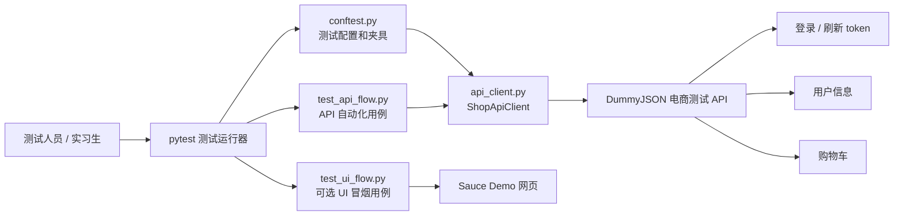
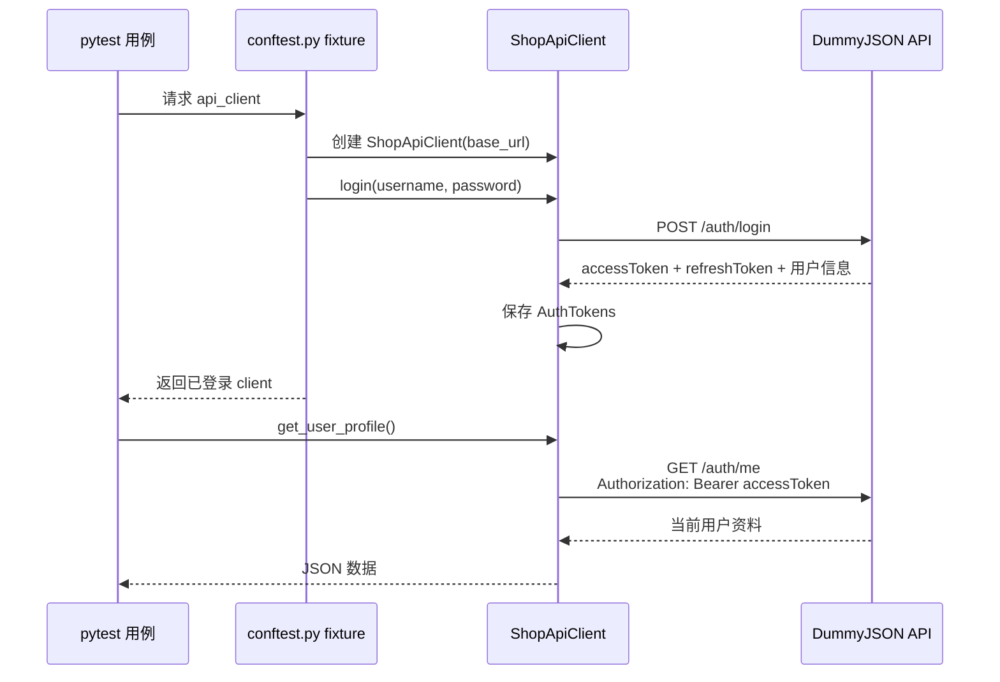
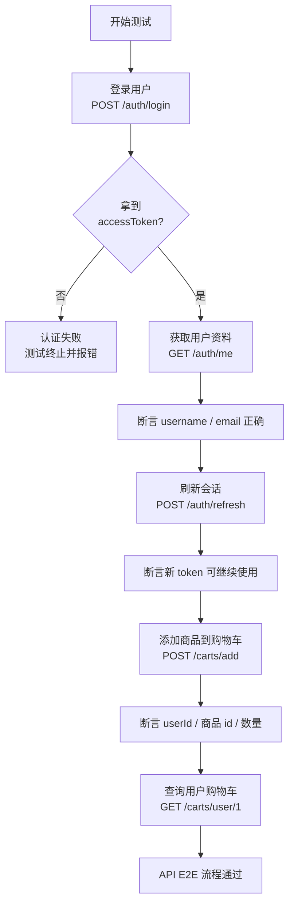
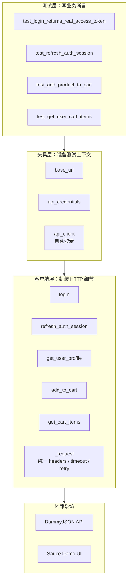
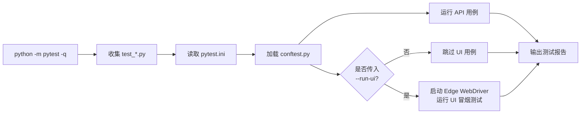
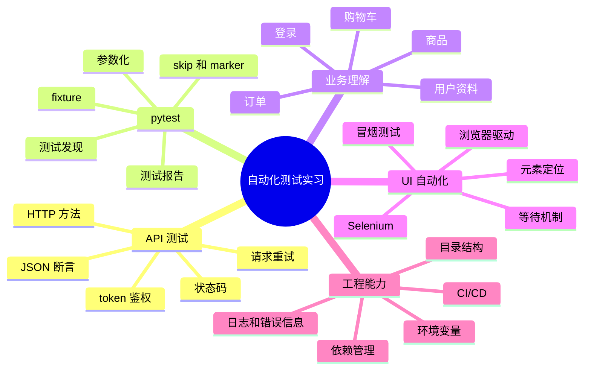

# 电商自动化测试项目理解图谱

这份文档帮助你从“业务流程、代码结构、token 鉴权、测试执行链路、实习学习重点”五个角度理解当前项目。

## 1. 项目整体结构



你可以把这个项目理解成一个小型自动化测试框架：

- `pytest` 负责发现和执行测试。
- `conftest.py` 负责准备公共测试对象，比如已经登录好的 API client。
- `api_client.py` 负责封装接口请求，不让测试用例直接写一堆重复的 `requests.post/get`。
- `test_api_flow.py` 写真实业务断言，比如“能登录”“能刷新 token”“能加购物车”。
- `test_ui_flow.py` 是可选 UI 测试，只有加 `--run-ui` 才运行。

## 2. 真实 token 获取流程



这就是你之前“拿不到真实 token”的核心位置。旧代码取的是 `token` 字段，但现在 DummyJSON 返回的是 `accessToken`。当前项目已经兼容：

- 优先取 `accessToken`
- 兼容旧 mock 里的 `token`
- 保存 `refreshToken`
- 后续请求自动带 `Authorization: Bearer <accessToken>`

## 3. 电商业务测试链路



这里的“E2E”不是只看页面，而是从用户身份开始，走到核心业务动作：

1. 用户能登录。
2. token 能被真实接口接受。
3. token 能刷新。
4. 用户能完成购物车业务。
5. 返回数据符合预期。

这就是接口自动化里非常常见的一条主链路。

## 4. 代码职责分层



实习里你会经常听到“分层设计”。这个项目现在就是一个简化版：

- 测试层只关心“业务对不对”。
- 夹具层负责“测试前要准备什么”。
- 客户端层负责“怎么请求接口”。
- 外部系统是真实被测服务。

好的自动化测试项目，通常不会把所有东西都塞进一个测试函数里。

## 5. pytest 执行流程



当前默认命令：

```powershell
python -m pytest -q
```

默认只跑 API 自动化。UI 测试需要浏览器和 WebDriver，所以用下面命令显式开启：

```powershell
python -m pytest -q --run-ui
```

## 6. 自动化测试实习学习地图



如果你以后继续完善这个项目，可以按这个顺序进阶：

1. 先把 API 主链路稳定跑通。
2. 再补更多业务接口，比如商品查询、订单创建、异常登录。
3. 再加参数化，把多个用户、多个商品组合跑起来。
4. 再加测试报告，比如 `pytest-html` 或 Allure。
5. 最后再把 UI 自动化接进来，做少量关键冒烟测试。

## 7. 一句话理解这个项目

这个项目的核心价值是：用 pytest 驱动真实接口请求，通过 `ShopApiClient` 获取并携带真实 `accessToken`，验证一个电商用户从登录到购物车操作的关键业务链路是否可用。
